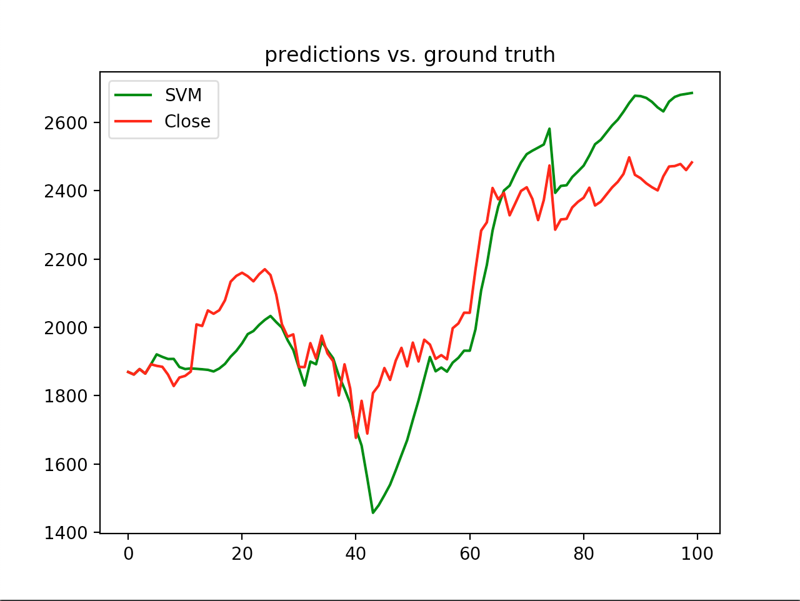
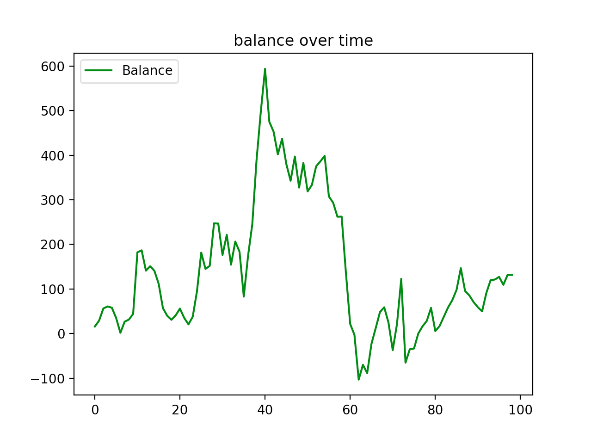
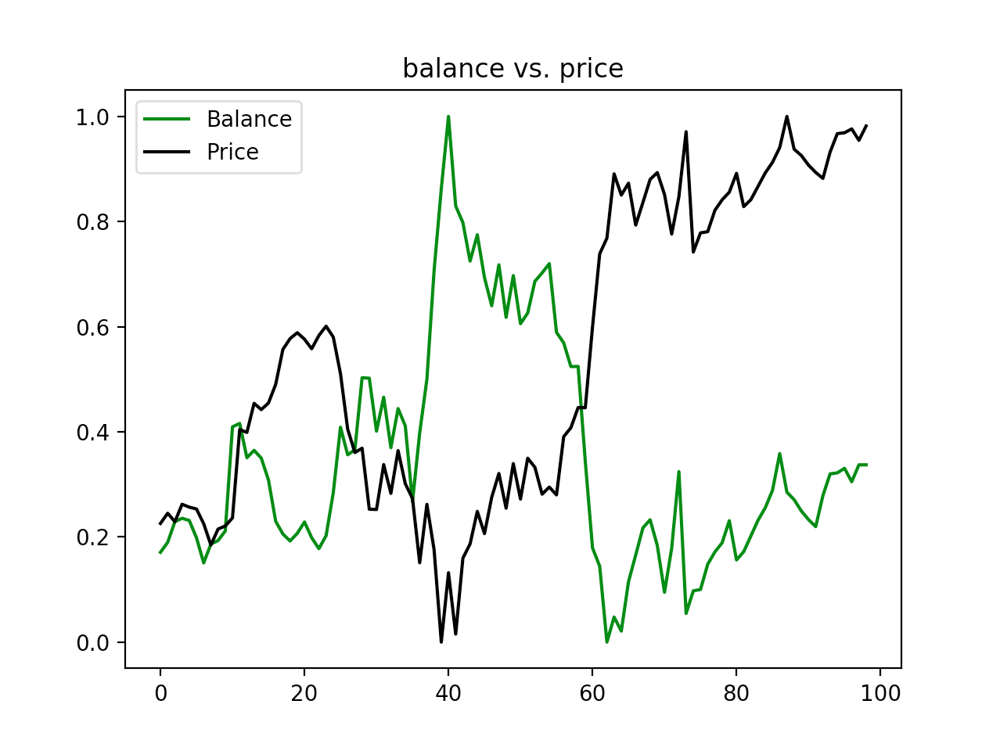
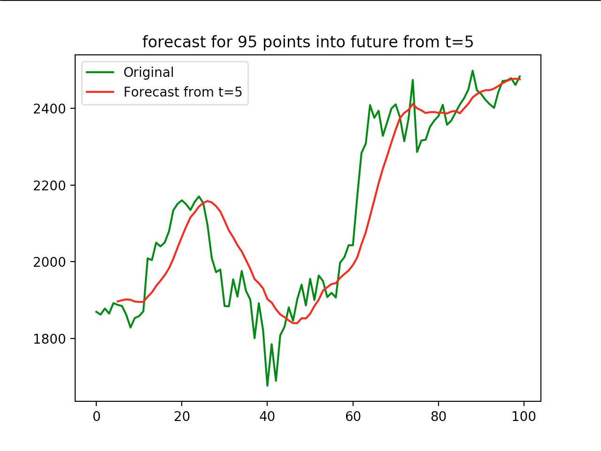
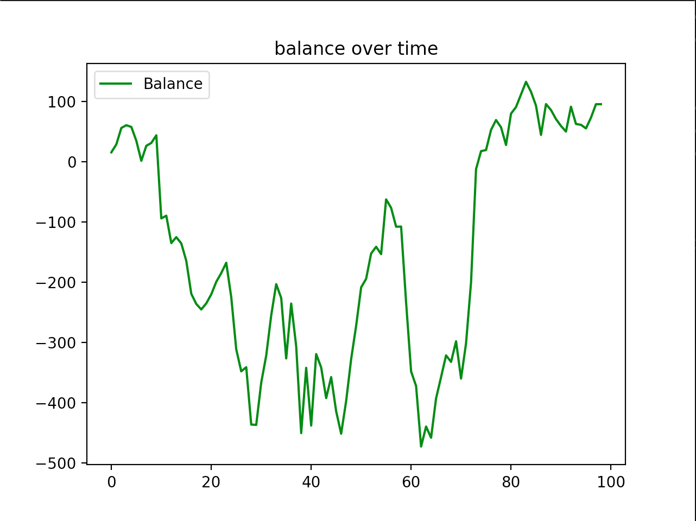
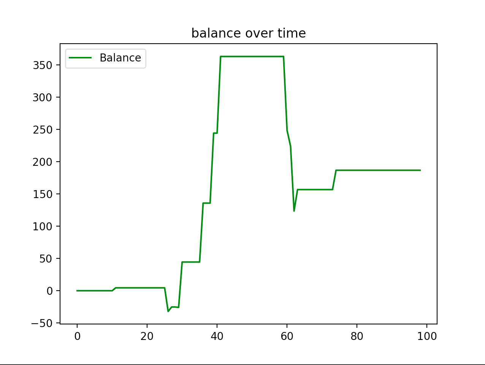

# Timeseries Prediction Package w/ Thresholding

This repository contains the source code for the package that allows for predictions on time series, designed to be
modular and to be used with various methods and variants of data.
<hr/>

### Project Organization
The code is organized as follows
- `__tests__` - unit tests for specific functionality that is important for accurate forecasting / thresholding
- `core` - code for making forecasts from training data, running a simulation with hyper-parameters
- `data` - where raw data files (usually `.csv`) for time series data are expected to be read from
- `loaders` - code for data loaders that can load raw data from disk or also download data if required or 
if specific data is required. Currently an AlphaVantage data loader is implemented that can both read data from disk
and download data if provided with an API key
- `methods` - classes for various prediction methods / models
- `preparers` - code for data preparers that can be used to transform DataFrames loaded with data loaders from `/loaders` into formats that
are expected by prediction functions / methods
- `utils` - various utility functions that are shared across other functions, as well as visualization plot functions

<hr/>

### Quickstart

The easiest way to try running the code is with the `experiment.py` file.

1. Install the required packages with
```
pip3 install -r requirements.txt 
```
3. Run the tests
```
python3 -m unittest discover -s __tests__ -p '*_test.py'
```
2. Run the file with 
```
python3 experiment.py
```

The `experiment.py` file has additional comments that explain the steps which the script takes to make forecasts and
visualize the predictions / results. For a more detailed write-up, please see the following _Walkthrough_ section.

<hr/>

### Walkthrough

The package is designed to be as modular as possible and independent of the specific data that is being forecasted. Since each sub-part
of the full pipeline is organized in self-containing modules, if a new data source / data type is used, the relevant data
loaders and prepares can be easily added, while the rest of the code (especially prediction methods) can be left unchanged, 
simplifying the process of experimentation.

The same process holds for the forecasting methods that can be used - it is quite simple to keep adding new methods as described
in the following _Adding Methods_ section.

#### Data Loading

The `/loaders` directory is designed to keep functions that are responsible for loading raw data from disk or via the network
into a Python `DataFrame`, `Series` or equivalent. Currently, a set of functions is provided for loading `.csv` files for 
stock ticker data as well as functions to download such data from AlphaVantage API via network. This can be
useful if data needs updating, and if a specific time granularity or type of data is needed for the time series, 
the corresponding data loader can be easily edited to add support. 

For example, if working with stock ticker data, a call to 
```python
get_ticker_data('AMZN', interval='daily')
```
will load the data from a corresponding `AMZN.csv` file provided as an example into a Python `DataFrame`.

#### Data Preparation

After loading the data into memory via a relevant data loader, the next step is to create or use a corresponding 
'preparer' function in `/preparers`. The directory is a module containing functions that take a DataFrame and should return
__2 values__ - `x_features` and `y_features`, corresponding to the features that will be used to train the forecasting model. 
A data preparer should essentially do feature pre-processing and select the columns that a particular method may find beneficial when
"fitting" to the data (training).

For example, if working with stock ticker data and wanting to do forecasting with an SVM method, assuming `data_df` contains the required
columns ('close', 'date'), a call to 
```python
x_features, y_features = ticker_svm(raw_data=data_df)
```
will perform pre-processing to add data about day-of-week, and assign the columns to `x_features` (everything but 'close') and `y_features`
('close' price) before returning them.

#### Forecasting

After the `x_features` and `y_features` are ready by the preparer, one can perform the forecasting step. When doing forecasting, given
an array of features corresponding to the quantity we are interested in forecasting (usually `y_features`),
```
y_1, y_2, y_3, ... , y_n
```
we are interested in generating a corresponding array of same length that represents predicted values for each ground truth value
```
y'_1, y'_2, y'_3, ... , y'_n
```
In the package we can do this via the `forecast(method, data, start_t, diff_order, look_back)` function. The parameters are as follows:
- `method` - a forecasting method extending the `Method` abstract class (more information in _Adding Methods_ section)
- `data` - a tuple of (`x_features, y_features`) 
- `start_t` - a time to start forecasting from
- `look_back` - amount of time steps the forecasting method can "look back" from a time step `t` to make a forecast. Default is `-1` and
signifies looking back __as many time steps as possible__ from current `t`
- `diff_order` - differentiation order. Default is `'1'`

The `forecast` function generates a numpy list of predictions / forecasts given this data and parameters and ensures that the length of the
predictions returned is the same as the size of `y_features`, that is, if the starting point is > 0, the returned forecasts will be padded with
original data. The function also supports varying look back and out-of-bounds checks, such that if a time step is < than the look
back value, the look back value will be adjusted such that the method does not access data out-of-bounds.

Additionally, there is a `forecast_from_t()` function implemented that supports predicting all time steps at once, as opposed to one-by-one as 
in the `forecast()` function. An example for using `forecast_from_t()` is given in _Examples_ section.

As an example, a call to 
```python
predictions = forecast(method=SVM(), data=(x_features, y_features), start_t=7, look_back=14)
```
will generate a numpy array of predictions of length `N`, where `N` is also the length of both `x_features` and `y_features`. The forecast
will use the support vector machines `SVM()` method class, start predictions at time step `t=7`, and look back 14 steps at each time step
in order to train the model with the data when making a forecast.

#### Simulating Actions (Trades)

After an array of `predictions` has been generated via the forecasting function, the next step is to run a simulation of actions taken against
this forecast and the ground truth. If working with financial data and data such as closing stock prices, this simulation will most likely be
along the lines of buy / sell decisions, i.e. make a decision on whether to buy at time step `t` and sell at `t+1`, short at `t` and buy back at
`t+1`, or perhaps not take any action at all. A simulation can then consist of using the forecasts and ground truth values to "simulate" making
such decisions for every time step, and measuring gain / loss of profits.

The function for this type of financial trading simulation is given with the `simulate_trades_continuous(predictions, ground_truth, threshold, slowed, verbose)`
function, and can be found in `core/simulation.py`. The parameters are as follows:
- `predictions` - array of forecasts as given by the `forecast()` function
- `ground_truth` - array of ground truth values to compare the forecasts to. Note: if working with DataFrames, you may need to call `.to_numpy()` on
the `y_features` data, since the function expects both predictions and ground truth arrays to be numpy arrays
- `threshold` - value (0 - 100) to threshold decisions by. If the percent change in two *forecasted* time series values is not greater than this threshold value, no 
action is taken. Default is `0`
- `verbose` - flag to enable detailed logging for what the simulation function is doing and which decisions are made. Useful for debugging. Default is `False`
- `slowed` - flag to slow down the simulation such that there is a pause after each decision. Useful for debugging. Default is `False`

The function is geared towards buy / sell decisions, but can easily be extended to perform decisions on other data, as the logic can remain the
same for making decisions based on a threshold between two consecutive forecasted values. The return value of the function is a list representing
the historical _balances_ while the simulation was running, i.e. the values of gain / loss over time.

As an example, a call to
```python
balances = simulate_trades_continuous(predictions=predictions, ground_truth=ground_truth, threshold=5, slowed=False, verbose=True)
``` 
will run a buy / sell simulation on forecasted prices vs. the ground truth, but only executing trades if the forecasted percent change
from time `t` to time `t+1` is at or above 5%. Please see the `change_above_threshold()` function in `utils/general.py` for the helper function
that checks for the threshold condition. Balances will hold the gain / loss values of the simulation over time.

#### Visualizing Results

After running a buy / sell, or any kind of action simulation based on the forecasts vs. the ground truth, a final useful step might be
to generate some visualization for what the simulation did, the balance over time as a plot, or the values that were forecasted. Note that
this is technically optional as the final "gain / loss" value of the simulation can be found by looking at the last value of `balances` from
the simulation step (`balances[-1]`). There are a couple of visualization helper functions provided with the package, and one can find more
details in the `utils/viz.py` file. 

Some plotting functions that may be useful:
- `plot_time_series(ts_1, ts_label_1, ts_2, ts_label_2, title):` - Plots 2 time series side-by-side, along with supplied labels and titles. Useful for comparing 
predictions vs. ground truths visually. Example:



- `plot_balance()` - Plots a time series of `balance` list over time that is returned by the simulation. Useful for inspecting how the gain / loss has
changed over time. Example:



- `plot_balance_vs_price(balances, price, title)` - Plots two time series for balance over time and the original ground truth price. Useful for
seeing how the gain / loss has changed with movement of the underlying ground truth value. Example: 



- `plot_time_series_with_forecast(time_series, forecast)` - Plots the original time series and the forecast from a specific time point. Useful
for visualizing predictions made directly from a time step `t` for `N` points into the future with the `forecast_from_t()` function. Example: 



<hr/>

### Adding Methods

Since the actual forecasting of time series may be of great importance / interest, the package is designed to easily
support new "methods", also referred to as models. The package uses an abstract class to represent a method, called `Method`
found in `/methods/__init__.py`. The class requires two functions to be implemented, `predict_next_n()` and `predict()`, 
for predicting `n` time steps into the future from the current step, and predicting a specific time step `t`, respectively.

Therefore, adding a new forecasting method is as simple as creating a new file in `/methods` and a new class that extends the
`Method` class. In more detail, the `predict(self, t, x_data, y_data, look_back=-1)` function can be understood as follows:

- `t` - the time step at which to predict 
- `x_data` - a list of `x_features`
- `y_data` - a list of `y_features`
- `look_back` - value to "look back" this many time steps to use to train / fit the model

Inside of the `predict()` implementation, you may be interested in using the `training_data_for_t()` util method
to get a correct "slice" of data to fit the model on. In addition to that, inside of this function you likely will 
create an instance of some model (if using `sklearn`, for instance), and call some code to "fit" (train) the model, 
before finally returning the result. A good example to take a look at could also be the `/methods/svm.py` and `/methods/lr.py`
files which follow this design pattern. 

To summarize the steps to add a method

1. Add a new file in `/methods` to contain the code for your method class
2. Create a new class `MyMethod` and extend the `Method` abstract class from `/methods/__init__.py` 
3. Implement the two required functions on the `Method` class - `predict()` and `predict_next_n()` that must
return either 1 or `n` values in an array, respectively
4. Import your method from a script and pass the method into the `forecast()` function as you would with any other method

<hr/>

### Examples

A couple of working examples to demonstrate functionality.

_Forecasting ticker data with SVM and no thresholding_

```python
from methods.svm import SVM
from preparers import ticker_svm
from core.functions import forecast
from core.simulation import simulate_trades_continuous

from loaders.alphavantage import get_ticker_data
from utils.viz import plot_time_series, plot_balance

# Data Loading
data_df = get_ticker_data('AMZN', interval='daily')
# Data Preparation
x_features, y_features = ticker_svm(raw_data=data_df)
ground_truth, start_t = y_features.to_numpy(), 5
# Forecasting
predictions = forecast(method=SVM(), data=(x_features, y_features), start_t=start_t, look_back=14)
# Simulation
balances = simulate_trades_continuous(predictions=predictions, ground_truth=ground_truth, slowed=False, verbose=False)
# Visualization
plot_time_series(ts_1=predictions, ts_label_1='SVM', ts_2=ground_truth, ts_label_2='Close', title='SVM predictions vs. ground truth')
plot_balance(data=balances)
```

_Forecasting ticker data with Regression, with & without thresholding for comparison_
```python
from preparers import ticker_lr
from methods.lr import LinearRegression
from core.functions import forecast
from core.simulation import simulate_trades_continuous

from loaders.alphavantage import get_ticker_data
from utils.viz import plot_balance, plot_balance_vs_price, plot_time_series

# Data Loading
data_df = get_ticker_data('AMZN', interval='daily')
# Data Preparation
x_features, y_features = ticker_lr(raw_data=data_df)
ground_truth, start_t = y_features.to_numpy(), 5
# Forecasting
predictions = forecast(method=LinearRegression(), data=(x_features, y_features), start_t=start_t, diff_order='1', look_back=3)
# Simulation without thresholding
balances_no_threshold = simulate_trades_continuous(predictions=predictions,
                                                   ground_truth=ground_truth,
                                                   slowed=False,
                                                   verbose=False,
                                                   threshold=0)
# Simulation with thresholding at 5%
balances_with_threshold = simulate_trades_continuous(predictions=predictions,
                                                     ground_truth=ground_truth,
                                                     slowed=False,
                                                     verbose=False,
                                                     threshold=5)
# Visualization
plot_time_series(ts_1=predictions, ts_label_1='LR', ts_2=ground_truth, ts_label_2='Close', title='predictions vs. ground truth')

plot_balance(data=balances_no_threshold)
plot_balance(data=balances_with_threshold)

plot_balance_vs_price(balances=balances_no_threshold, price=ground_truth[1:], title='balance vs. price (no thresholding)')
plot_balance_vs_price(balances=balances_with_threshold, price=ground_truth[1:], title='balance vs. price (with thresholding)')
```
No thresholding: 



With thresholding: 



_Forecasting ticker data with Moving Average all at once_

```python
from preparers import ticker_sma
from methods.sma import MovingAverage
from core.functions import forecast_from_t

from loaders.alphavantage import get_ticker_data
from utils.viz import plot_time_series_with_forecast

# Data Loading
data_df = get_ticker_data('AMZN', interval='daily')
# Data Preparation
x_features, y_features = ticker_sma(raw_data=data_df)
ground_truth, start_t = y_features.to_numpy(), 5
# Forecasting
predictions = forecast_from_t(method=MovingAverage(), data=(x_features, y_features), start_t=start_t, look_back=10)
# Visualization
plot_time_series_with_forecast(time_series=y_features, forecast=predictions)
```